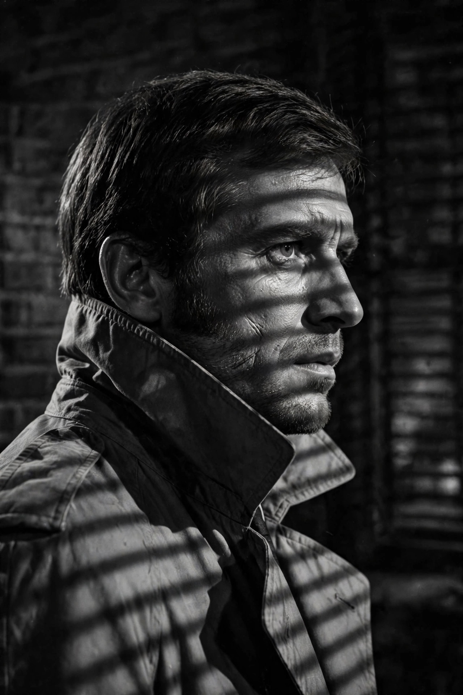
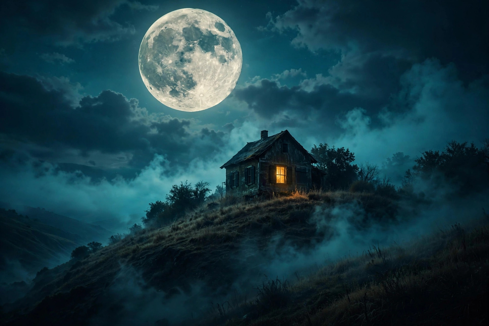
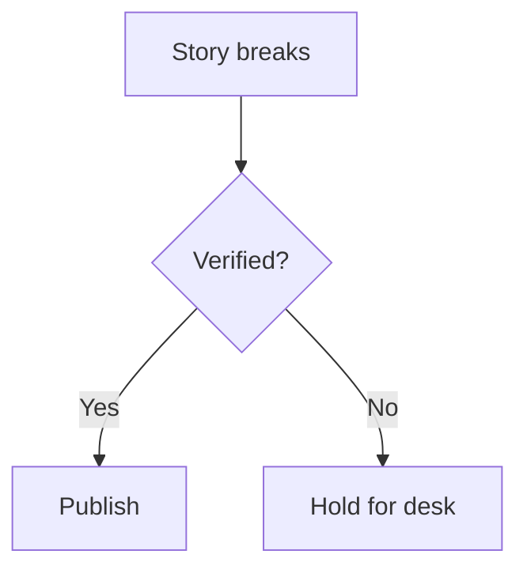

This is the desk's component bible. For each piece you get the **source** first, then the **live** result — what you see rendered below the source is exactly what the markup produces. Copy the source, change the words, file it.

## Timeline

A vertical incident line. One `-` per event; split time from text with `—`.

```text
:::timeline
- 04:17 — Undersea cables go dark off Kochi
- 04:40 — Backup relays engaged, grid holding
- 06:30 — Field team dispatched to landing station
:::
```

**Live:**

:::timeline
- 04:17 — Undersea cables go dark off Kochi
- 04:40 — Backup relays engaged, grid holding
- 06:30 — Field team dispatched to landing station
:::

## Images with filters

Add `filter:` to the image title for CSS filters, then `|` and a caption.

```text
 contrast(1.15) | Archive still, color withheld")
 contrast(1.05)")
```

**Live:**

 contrast(1.15) | Archive still, color withheld")

 contrast(1.05)")

Any CSS filter works: `blur(2px)`, `invert(1)`, `saturate(2)`, chained combos.

## Spoiler images

Put `spoiler:` first in the title and the image stays blurred behind a **SPOILER** cover until tapped.

```text

```

**Live:**


## Video player

Themed player with play, seek, time, mute and fullscreen. `src` can be a file in `/posts` or a URL.

```text

```

**Live:**



## Audio embed

```text

```

**Live:**



## YouTube embed

```text

```

**Live:**



And a generic framed embed for anything else:

```text

```

## Code

Inline code looks like `this`. Fenced blocks become a code box with the language stamped on top and a **copy button**. Syntax is classified monochrome — keywords bold, comments faint, no rainbow.

````text
```js
const dead_drop = {
  city: "Kochi",
  hour: "04:17",
  status: "COMPROMISED"
};
console.log(dead_drop.status);
```
````

**Live:**

```js
const dead_drop = {
  city: "Kochi",
  hour: "04:17",
  status: "COMPROMISED"
};
console.log(dead_drop.status);
```

No language tag? You still get the box, stamped `TEXT`.

```
plain block, no language
second line
```

## Boxes

Bordered evidence boxes. Optional kinds: `red`, `ghost`.

```text
:::box Evidence locker
Chain of custody for items recovered at the landing station.
:::

:::box red Do not publish
Names in this section are unverified. Hold for legal.
:::

:::box ghost Marginalia
A quiet box for asides. No shadow, no noise.
:::
```

**Live:**

:::box Evidence locker
Chain of custody for items recovered at the landing station.
:::

:::box red Do not publish
Names in this section are unverified. Hold for legal.
:::

:::box ghost Marginalia
A quiet box for asides. No shadow, no noise.
:::

## Stat callout

A big-number callout for the figures that matter. First line is the number, the rest is the label. Optional kinds: `red`, `ghost`.

```text
:::stat
₹4.2 cr
Funds traced to shell accounts
:::

:::stat red
17
Arrests made before dawn
:::
```

**Live:**

:::stat
₹4.2 cr
Funds traced to shell accounts
:::

:::stat red
17
Arrests made before dawn
:::

Inline markup works in the number too: `:::stat` then `:hl[04:17]` on the first line.

## Tables

Plain markdown tables scroll horizontally on phones — no squished columns.

```text
| Segment | Splices | Status |
|---|---|---|
| Mumbai — Panvel | 6 | unlicensed |
| Goa — Mangaluru | 13 | unlicensed |
```

**Live:**

| Segment | Splices | Status |
|---|---|---|
| Mumbai — Panvel | 6 | unlicensed |
| Goa — Mangaluru | 13 | unlicensed |

## Multi-tab tables

One `:::tabs` block, one `##` heading per tab. Each tab holds anything — tables, lists, paragraphs.

```text
:::tabs
## Personnel
| Name | Role |
|---|---|
| A. Rao | Field lead |
| J. Menon | Signals |

## Arsenal
| Item | Count |
|---|---|
| Burner phones | 12 |
| Faraday bags | 30 |
:::
```

**Live:**

:::tabs
## Personnel
| Name | Role |
|---|---|
| A. Rao | Field lead |
| J. Menon | Signals |

## Arsenal
| Item | Count |
|---|---|
| Burner phones | 12 |
| Faraday bags | 30 |
:::

## Lists

```text
- Undersea cable manifests
- Landing station logs
  - Night shift entries
  - Maintenance windows
- Burner phone metadata

1. Verify the source
2. Redact the names
3. File before dawn
```

**Live:**

- Undersea cable manifests
- Landing station logs
  - Night shift entries
  - Maintenance windows
- Burner phone metadata

1. Verify the source
2. Redact the names
3. File before dawn

## Checklist

```text
- [x] Verify the source
- [x] Photograph the stamp
- [ ] Redact the names
- [ ] Push to board
```

**Live:**

- [x] Verify the source
- [x] Photograph the stamp
- [ ] Redact the names
- [ ] Push to board

## Numbered sections

`:::section` blocks auto-number themselves: SEC. 01, SEC. 02…

```text
:::section The wire room
Everything downstream of the landing station routes through this room.
:::
```

**Live:**

:::section The wire room
Everything downstream of the landing station routes through this room.
:::

## Collapsing blocks

For material that's there if the reader wants it. Stack as many as you like — one after another, each with its own `:::` closer. (Don't nest them.)

```text
:::collapse Why this matters
Because the cables that went dark carry 40% of the region's traffic,
and nobody has explained the other 60%.
:::

:::collapse The dissenting view
Two engineers insist it was a maintenance window. Their logs disagree with each other.
:::
```

**Live:**

:::collapse Why this matters
Because the cables that went dark carry 40% of the region's traffic,
and nobody has explained the other 60%.
:::

:::collapse The dissenting view
Two engineers insist it was a maintenance window. Their logs disagree with each other.
:::

## Dividers

`---` gives a hard rule. A line of `***` gives the dossier diamond.

```text
---
```

---

```text
***
```

***

## Badges & tags

```text
:badge[VERIFIED] :badge-red[LEAK] :badge-ghost[DRAFT] :tag[whistleblower]
```

**Live:**

:badge[VERIFIED] :badge-red[LEAK] :badge-ghost[DRAFT] :tag[whistleblower]

## Text highlights

Marker-pen highlights with `:hl[text]`. Stays readable in every theme. Pick a color per highlight with `:hl-red[]`, `:hl-blue[]` or `:hl-green[]`.

```text
The stamp reads :hl[KOCHI 04:17] but the ink says otherwise.
:hl-red[This part is disputed.] :hl-blue[This part checks out.] :hl-green[Verified by two sources.]
```

**Live:**

The stamp reads :hl[KOCHI 04:17] but the ink says otherwise.
:hl-red[This part is disputed.] :hl-blue[This part checks out.] :hl-green[Verified by two sources.]

## Alert boxes

Five flavors. Start a quote block with `[!KIND]`; an optional title can follow on the same line.

```text
> [!NOTE]
> Ink weight on the stamp is wrong for a 2024 issue.

> [!TIP] Desk habit
> Photograph every stamp with a coin for scale.

> [!IMPORTANT]
> Do not contact the source twice in one week.

> [!WARNING]
> The landing station has cameras on the north gate.

> [!CAUTION]
> This file contains unverified names. Hold for legal.
```

**Live:**

> [!NOTE]
> Ink weight on the stamp is wrong for a 2024 issue.

> [!TIP] Desk habit
> Photograph every stamp with a coin for scale.

> [!IMPORTANT]
> Do not contact the source twice in one week.

> [!WARNING]
> The landing station has cameras on the north gate.

> [!CAUTION]
> This file contains unverified names. Hold for legal.

## Tooltips

```text
Hover over [this briefing](tooltip: Compiled from three independent sources, cross-checked.) to see the tip.
```

**Live:**

Hover over [this briefing](tooltip: Compiled from three independent sources, cross-checked.) to see the tip. On phones, tap the ⓘ icon.

**Pinning a file:** add `pinned: true` to a file's frontmatter and it stays above the top story with a pin badge. **Front-page images:** `image: raid.jpg` in frontmatter (a bare filename is read from `/posts`) puts a thumbnail on the news row and a banner on the hero. **Title highlights:** `:hl[]` (and `:hl-red[]` etc.) work inside titles and summaries on the front page.

## Keyboard keys

```text
Press <kbd>Ctrl</kbd> + <kbd>K</kbd> to open the file index.
```

**Live:**

Press <kbd>Ctrl</kbd> + <kbd>K</kbd> to open the file index.

## Buttons

`button:` links render as dossier buttons. Variants: `button:red:` and `button:ghost:`.

```text
[Open the board](button:#/board)
[Delete everything](button:red:#/board)
[Ghost protocol](button:ghost:#/board)
```

**Live:**

[Open the board](button:#/board)
[Delete everything](button:red:#/board)
[Ghost protocol](button:ghost:#/board)

## The classics

Still here, still working: ||spoilers||, ==redactions==, [[023-02|internal links]], spoiler images, footnotes[^1], `:::memo` callouts and pull quotes.

[^1]: Footnotes still land at the bottom of the file, numbered and linked.

## Download button

A proper dossier download — bordered button, file-type badge, works with bare filenames from `/posts`.

```text

```

**Live:**



## Rating stars

Partial fill, theme-aware gold (black in brutalism). Block or inline.

```text


The film scores :stars[3] from the desk.
```

**Live:**



The film scores :stars[3] from the desk.

## Person cards

An ID card: the first image becomes the portrait, the rest is info. Add `round` for a circular portrait.

```text
:::person round

**Ava Cross** — Field agent
Cleared for level 4. Speaks Malayalam, Hindi, English.
:::
```

**Live:**

:::person round

**Ava Cross** — Field agent
Cleared for level 4. Speaks Malayalam, Hindi, English.
:::

## Movie infobox

Wikipedia/IMDb style. First image is the poster, the first text line is the title, `Key: Value` lines become fact rows, and anything else becomes the synopsis.

```text
:::movie

Drishyam
Director: Jeethu Joseph
Year: 2013
Box office: $677747
Rating: :stars[4.5]
A gripping thriller about a man who will do anything to protect his family.
:::
```

**Live:**

:::movie

Drishyam
Director: Jeethu Joseph
Year: 2013
Box office: $677747
Rating: :stars[4.5]
A gripping thriller about a man who will do anything to protect his family.
:::

## Diagrams

Fence a block as `mermaid` and it renders as a diagram instead of code — flowcharts, sequence diagrams, class diagrams, and more. The library loads only when a diagram is on the page.

**Code:**

    ```mermaid
    flowchart TD
        A[Story breaks] --> B{Verified?}
        B -->|Yes| C[Publish]
        B -->|No| D[Hold for desk]
    ```

**Live:**



## Inline logo

Drop a logo anywhere in a sentence at any width (pixels). Handy for source attributions.

```text
Source:  rating 8.2/10.
```

**Live:**

Source:  rating 8.2/10.

## Aligned images

The `` directive gives you caption alignment: `center`, `left`, or `right`.

```text

```

**Live:**



## The press room

There is a secret route on this board: `#/press`. It isn't linked anywhere. Behind a code (default `ink`, change `PRESS_CODE` in `app.js`) sits a private studio — write Markdown, hit **PREVIEW** to see the file rendered with every component, then **COPY HTML** or **COPY MARKDOWN** to take the code with you.

## Charts

One `Label — value` (or `Label: value`) per line. Bars scale to the largest value; pie slices scale to the total.

:::bar Traffic by source
Google — 60
Direct: 25
Social — 15
:::

:::pie Budget split
Rent — 40
Food — 30
Fun — 20
Savings — 10
:::

## Editorial notices

:::tldr
Three sources confirmed the outage. The grid held by 4 AM.
:::

:::editor
We held this story for 48 hours while we verified the documents.
:::

:::correction 2026-09-20
An earlier version misstated the outage duration as 30 hours. It was 43.
:::

:::update
12:30 PM — The utility has confirmed the timeline in this story.
:::

## Fact check

Verdict goes on the first line: `TRUE`, `FALSE`, or `MIXED`. Anything else renders as UNVERIFIED.

:::factcheck FALSE
The claim that the grid failed twice is unsupported by the logs.
:::

## Spoilers, two ways

`||the butler did it||` is the classic black bar. Add a tilde — `||~the gardener helped||` — and the text renders blurred instead. Both reveal on tap or click.

## Code boxes: editor chrome, flags, diff

Every fenced block renders as an editor-style code box — dark surface, JetBrains Mono, and a popular syntax palette — identical in light, dark, and brutalism. The header shows the language (or a filename), with a collapse chevron and a copy button inside.

Add `file=name.ext` after the language to show a filename in the header, like an IDE tab:

```py file=bubble_sort.py
def bubble_sort(items):
    for i in range(len(items)):
        for j in range(len(items) - 1 - i):
            if items[j] > items[j + 1]:
                items[j], items[j + 1] = items[j + 1], items[j]
```

Flags after the language: `bare` (no header bar — tap inside the box and the copy button appears), `mono` (force monochrome), `diff` (paints `+`/`-`/`@@` lines). `color` is kept for back-compat; color is the default everywhere now.

```js bare
const quiet = true; // no header bar — tap inside the box and the COPY button appears
```

```diff
+ added line
- removed line
 context line
@@ hunk header @@
```

## Tabbed code: :::codetabs

One fenced block per `##` tab — for install instructions in npm/yarn/pnpm, or the same snippet in several languages.

:::codetabs
## npm
```bash
npm install fictional-bassoon
```
## yarn
```bash
yarn add fictional-bassoon
```
## pnpm
```bash
pnpm add fictional-bassoon
```
:::

## Social embeds

`` (or ``) embeds a post from X/Twitter; `` embeds a Reddit thread. Both load the platform's official widget only when used, and fall back to a plain link if the widget is blocked.

## Tables without pipes: :::table

First line is the header, cells split on `|`, optional caption after `:::table`. An optional second row of `:---`, `:---:`, `---:` sets alignment.

:::table Field kit
Item | Weight | Packed
Rope | 2 kg | Yes
Lens | 800 g | No
:::

## Cheat sheet

| You want | You write |
|---|---|
| Timeline | `:::timeline` … `- time — event` … `:::` |
| Filtered image | ` \| cap")` |
| Spoiler image | `` |
| Video player | `` |
| Audio | `` |
| YouTube | `` |
| Iframe | `` |
| Code box + copy | fenced ` ```lang ` block, `file=name.ext` for a filename header |
| Box | `:::box [red\|ghost] Title` … `:::` |
| Stat callout | `:::stat [red\|ghost]` … number … label … `:::` |
| Tabbed tables | `:::tabs` … `## Tab` … `:::` |
| Checklist | `- [ ]` / `- [x]` |
| Section | `:::section Title` … `:::` |
| Collapse | `:::collapse Title` … `:::` |
| Divider | `---` or `***` |
| Badge / tag | `:badge[]` `:badge-red[]` `:badge-ghost[]` `:tag[]` |
| Highlight | `:hl[text]`, `:hl-red[text]`, `:hl-blue[text]`, `:hl-green[text]` |
| Alert | `> [!NOTE\|TIP\|IMPORTANT\|WARNING\|CAUTION]` |
| Tooltip | `[text](tooltip: tip)` |
| Key | `<kbd>Key</kbd>` |
| Button | `[Label](button[:red\|:ghost]:url)` |
| Download | `` |
| Stars | `` or `:stars[4.5]` |
| Person card | `:::person [round]` … `:::` |
| Movie infobox | `:::movie` — poster, title, `Key: Value` rows … `:::` |
| Diagram | ` ```mermaid ` flowchart / sequence … ` ``` ` |
| Logo | `` |
| Aligned image | `` |
| Bar chart | `:::bar Title` … `Label — 40` … `:::` |
| Pie chart | `:::pie Title` … `Label — 40` … `:::` |
| Editor's note | `:::editor` … `:::` |
| Correction | `:::correction 2026-09-20` … `:::` |
| Update | `:::update` … `:::` |
| TL;DR | `:::tldr` … `:::` |
| Fact check | `:::factcheck TRUE\|FALSE\|MIXED` … `:::` |
| Blur spoiler | `||~text||` (drop the tilde for the black bar) |
| Bare code box | ` ```js bare ` — no header, copy appears on tap inside |
| Code flags | ` ```js color ` / ` ```js mono ` / ` ```diff ` |
| Tabbed code | `:::codetabs` … `## npm` + fenced block … `:::` |
| X/Twitter embed | `` or `` |
| Reddit embed | `` |
| Directive table | `:::table Caption` … `A | B` rows … `:::` |
